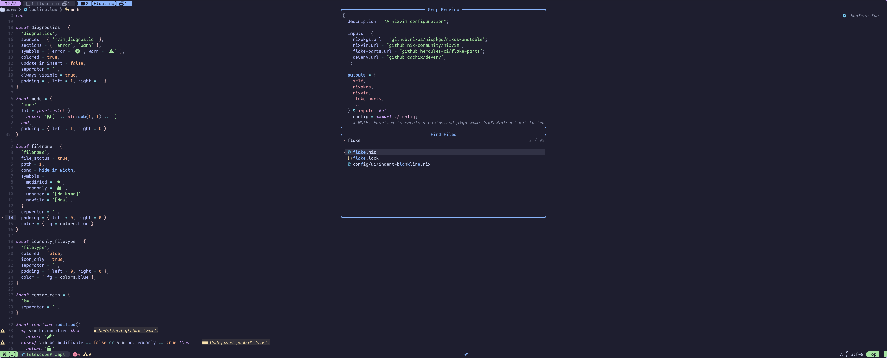

<!-- markdownlint-disable -->
<h1 align="center">
    <a name="top" title="nvim-nix">
        nvim-nix
    </a>
</h1>
<br />
<div align="center">
  <a href="https://github.com/dileep-kishore/neovim">
    
  </a>
  <p>
    <strong>
      A <a href="https://neovim.io/">Neovim</a> configuration as a <a href="https://nixos.org/">Nix</a> flake ❄️ template</br>
    </strong>
  </p>


</div>
<!-- markdownlint-restore -->

This flake uses [nixvim](https://github.com/nix-community/nixvim) to configure neovim in a declarative manner. Since this configuration uses nixvim, this means that it is entirely written in [Nix](https://nixos.org/manual/nix/stable/language/index.html) with some custom Lua sprinkled in here and there.

## Running the flake

To run this nix flake simply run the following command

```
nix run github:dileep-kishore/neovim
```

> NOTE:
> You will need to install the `nix` package manager before you can run the previous command

Or you can use [home-manager](https://github.com/nix-community/home-manager) to add this flake to your setup like so:

```nix
{
    inputs.neovim = {
      url = "github:dileep-kishore/neovim";
      inputs.nixpkgs.follows = "nixpkgs";
    };
}
```

And then install it by adding `inputs.neovim.packages.${system}.default` to your packages

## Gallery

|                   _Dashboard_                    |
| :----------------------------------------------: |
|              |
|                      |
|  |
|                          |
|              |

## Features

- Works out of the box without needing to install any external dependencies. This includes lsp servers, linters, formatters or other packages.
- A lot of the default options and autocmds that you would find on a distribution like [LunarVim](lunarvim.org/) are configured out of the box
- [Treesitter](https://github.com/nvim-treesitter/nvim-treesitter) syntax highlighting is enabled and [catppuccin](https://github.com/catppuccin/nvim) theme is set as the default
- Uses custom statusline configured using [lualine.nvim](https://github.com/nvim-treesitter/nvim-treesitter)
- Custom tabline configured using [tabby.nvim](https://github.com/nvim-treesitter/nvim-treesitter)
- Includes [vim-fugitive](https://github.com/tpope/vim-fugitive), [neogit](https://github.com/NeogitOrg/neogit) and [lazygit.nvim](https://github.com/kdheepak/lazygit.nvim) for working with git
- Lsp servers, linters and formatters for configured for Python, Nix, Lua, Javascript, Typescript, Julia, Bash, Rust, Go and many more
- Debugging is supported through the [Debugging adapter protocol (DAP) plugin](https://github.com/mfussenegger/nvim-dap). This is currently only setup to work with Python
- Completions are enabled through [nvim-cmp](https://github.com/hrsh7th/nvim-cmp)
- Snippets are set up using [luasnip](https://github.com/L3MON4D3/LuaSnip) and [friendly-snippets](https://github.com/rafamadriz/friendly-snippets)
- [Telescope](https://github.com/nvim-telescope/telescope.nvim) for fuzzy file finding and searching
- AI capabilities are enabled through [ChatGPT.nvim](https://github.com/jackMort/ChatGPT.nvim) and [GitHub copilot](https://github.com/zbirenbaum/copilot.lua)
- Indent lines are enabled using [indent-blankline.nvim](https://github.com/lukas-reineke/indent-blankline.nvim) and [mini.indentscope](https://github.com/echasnovski/mini.indentscope)
- The dashboard is set up using [alpha-nvim](https://github.com/goolord/alpha-nvim)
- Many other features! Check out default.nix and plugins.nix

<!-- MARKDOWN LINKS & IMAGES -->

[neovim-shield]: https://img.shields.io/badge/NeoVim-%2357A143.svg?&style=for-the-badge&logo=neovim&logoColor=white
[neovim-url]: https://neovim.io/
[nix-shield]: https://img.shields.io/badge/nix-0175C2?style=for-the-badge&logo=NixOS&logoColor=white
[nix-url]: https://nixos.org/
[lua-shield]: https://img.shields.io/badge/lua-%232C2D72.svg?style=for-the-badge&logo=lua&logoColor=white
[lua-url]: https://www.lua.org/
